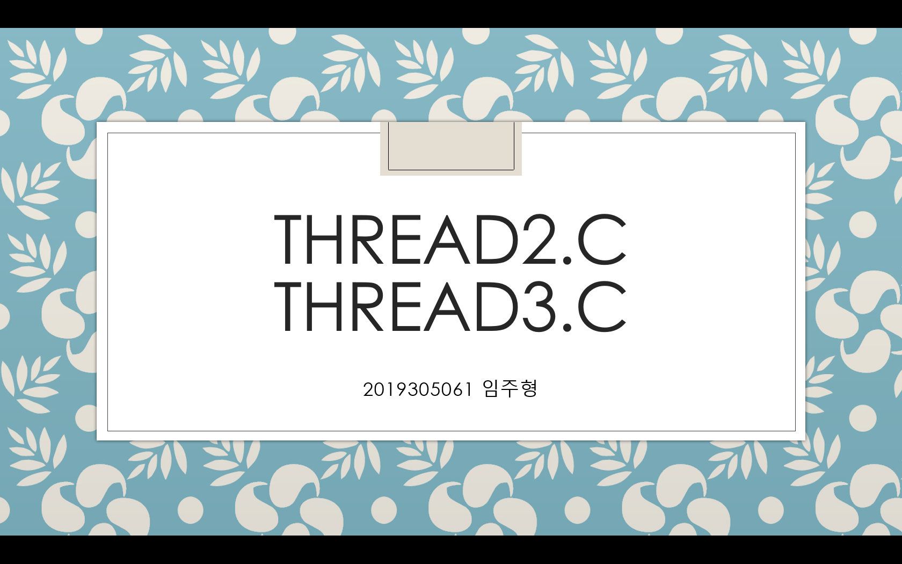

# Operating System Class
> ## 1st presentation
> - ### [prac3_7.c](https://github.com/LimJuHyung1/OS_Class/blob/main/1st_Presentation/prac3_7.c)  
> - ### [prac3_8.c](https://github.com/LimJuHyung1/OS_Class/blob/main/1st_Presentation/prac3_8.c)  
>  
>  
>  
>  
>  
> - - -
> ## 2nd presentation
> - ### [thread2.c](https://github.com/LimJuHyung1/OS_Class/blob/main/2nd_Presentation/thread2.c)  
> - ### [thread3.c](https://github.com/LimJuHyung1/OS_Class/blob/main/2nd_Presentation/thread3.c)  
>  
>  
>  
>  
>  
> - - -
> ## 3rd presentation
> - ### [sem.c](https://github.com/LimJuHyung1/OS_Class/blob/main/3rd_Presentation/sem.c)  
>  
>  
>  
